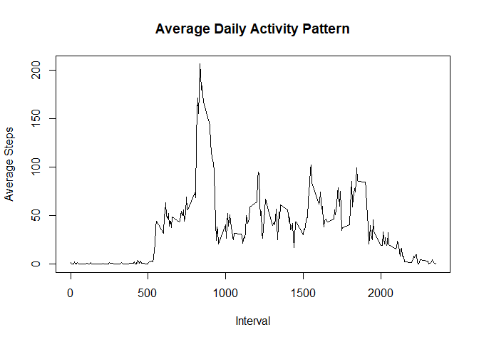
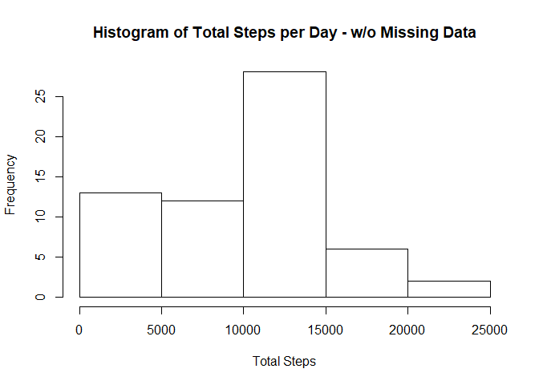
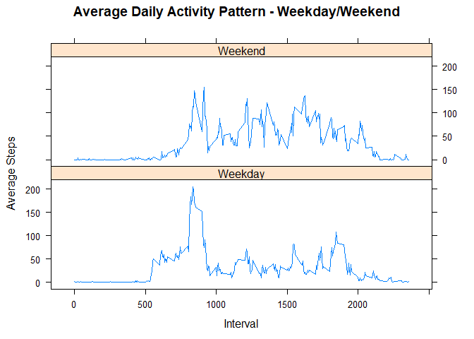

# Reproducible Research: Peer Assessment 1
  
  

```r
library(dplyr)
library(lattice)
```

### Loading and preprocessing the data

Unzip the data file and read the data using read.csv into a data frame called activity_data. Convert the data frame to a tibble.  


```r
activity_data <- read.csv(unz("activity.zip", "activity.csv"), header = TRUE, 
               na.strings = "NA", colClasses = c("integer", "Date", "integer"))
activity_data <- tbl_df(activity_data)
```
  
  
***  
  
### What is mean total number of steps taken per day?

Compute the total number of steps per day by grouping the data by activity_data$date and summarizing into a new data frame with total column.  


```r
steps_per_day <- activity_data %>% 
                group_by(date) %>%
                summarize(total = sum(steps, na.rm = TRUE))
```
  
  
Plot a histogram of the total steps per day using the steps_per_day data frame.  


```r
hist(steps_per_day$total, xlab = "Total Steps", ylab = "Frequency", 
     main = "Histogram of Total Steps per Day")
```

<!-- -->
  
  
Compute and print the mean and median of steps_per_day$total.  


```r
mean_steps <- round(mean(steps_per_day$total), 0)
median_steps <- median(steps_per_day$total)
```
  
  
Mean and Median of Total Steps per Day

- Mean of Total Steps per Day = **9354**  
  
- Median of Total Steps per Day = **10395**  
  
  
***  
  
### What is the average daily activity pattern?
  
  
Compute the total number of steps per day by grouping the data by activity_data$date and summarizing into a new data frame with total column.  


```r
avg_daily_activity <- activity_data %>% 
                        group_by(interval) %>% 
                        summarize(avg = mean(steps, na.rm = TRUE))
```

  
  
Plot a line graph of the average steps per interval using avg_daily_activity.  


```r
plot(avg_daily_activity$interval, avg_daily_activity$avg, type = "l", 
     xlab = "Interval", ylab = "Average Steps", 
     main = "Average Daily Activity Pattern")
```

<!-- -->
  
  
Compute and print the interval where avg_daily_activity$avg is maximum.  


```r
max_interval <- avg_daily_activity[avg_daily_activity$avg == 
                                       max(avg_daily_activity$avg), ]$interval
```

  
The 5-minute interval with maximum average steps = **835**  
  
  
***  
  
### Imputing missing values


```r
missing_row_count <- nrow(activity_data[is.na(activity_data), ])
```
  
  
Number of rows with missing values = **2304**  
  
Impute the rows where data is missing by filling the average of the same interval from other days


```r
imputed_activity_data <- activity_data %>% 
                        group_by(interval) %>% 
                        mutate(steps = replace(steps, is.na(steps), 
                                               median(steps, na.rm = TRUE)))

imputed_steps_per_day <- imputed_activity_data %>% 
                        group_by(date) %>%
                        summarize(total = sum(steps, na.rm = TRUE))
```
  
  
Plot a histogram of the total steps per day using the imputed_steps_per_day data frame.  


```r
hist(imputed_steps_per_day$total, xlab = "Total Steps", ylab = "Frequency", 
     main = "Histogram of Total Steps per Day - w/o Missing Data")
```

<!-- -->
  
  
Compute and print the mean and median of imputed_steps_per_day$total.  


```r
mean_imputed_steps <- round(mean(imputed_steps_per_day$total), 0)
median_imputed_steps <- median(imputed_steps_per_day$total)
```
  
  
Mean and Median of Total Steps per Day using imputed data.

- Mean of Total Steps per Day = **9504**  
  
- Median of Total Steps per Day = **10395**  
  
  
After imputing the data to remove missing values, mean is slightly higher but median is the same as the original data.  
  
***  
  
### Are there differences in activity patterns between weekdays and weekends?

Add a new variable day_type to imputed_activity_data for segregating weekday and weekend activity. Summarize the data for both day_types by computing the average steps taken in each interval. 


```r
imputed_activity_data <- imputed_activity_data %>% 
                        mutate(day_type = ifelse(weekdays(date) %in% 
                                                     c("Saturday", "Sunday"), 
                                                 "Weekend", "Weekday"))

imputed_activity_data$day_type <- as.factor(imputed_activity_data$day_type)

avg_daily_activity_type <- imputed_activity_data %>% 
                            group_by(day_type, interval) %>% 
                            summarize(avg = mean(steps))
```
  
  
Plot a panel plot of two line graphs of the average steps per interval using avg_daily_activity_type for weekdays and weekends separately.  


```r
xyplot(avg~interval|day_type, data = avg_daily_activity_type, type = "l", 
       layout = c(1,2), xlab = "Interval", ylab = "Average Steps", 
       main = "Average Daily Activity Pattern - Weekday/Weekend")
```

<!-- -->
  
  
***  
  
